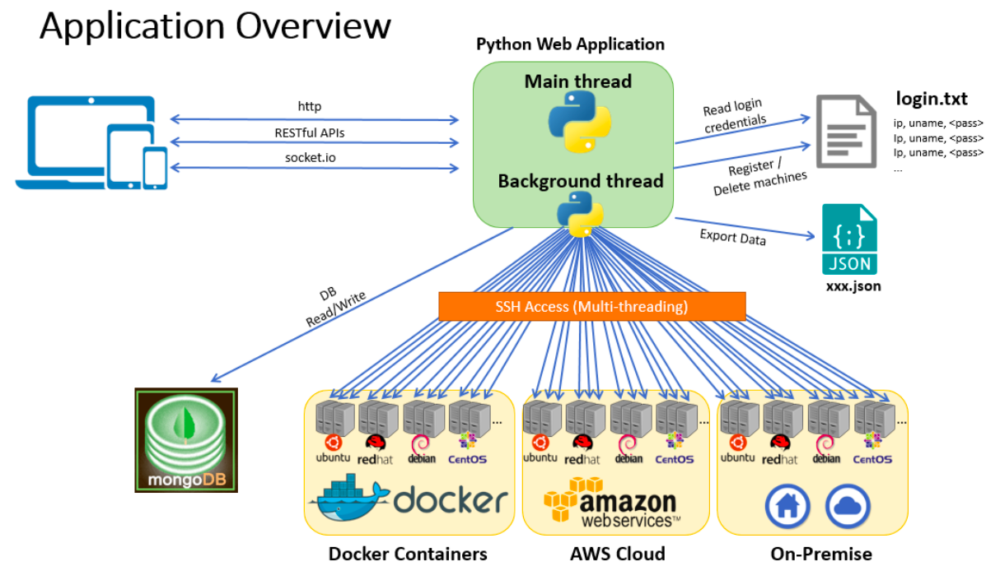

Management Application for Linux Machines
=========================================

## Table of Contents
1. [Introduction](#1-introduction)
2. [Supported environment](#2-supported-environment) 
3. [Install packages](#3-install-packages)
4. [Try it out](#4-try-it-out)
    - [With test infrastructure with Docker containers (Demo purpose only)](#1-with-the-test-docker-environment-demo-purpose-only)
    - [With your own infrastructure](#2-if-you-run-with-your-own-infrastructure)
5. [API Endpoints](#5-api-endpoints)
6. [Documentation](#6-documentation)

<br>

## 1. Introduction  
This is a full stack web application for managing remote Linux machines which:   
1) automatically and periodically collects basic system performance data from various remote Linux machines   
2) presents machine data and status on the central GUI management portal  
3) provides management functions through GUI and/or RESTful API interfaces  

As it was developed with an approach of Responsive Web Design, administrators can access to the GUI from any devices such as laptops, tablets, and mobile phones.  
By using this application, administrators can manage their various Linux machines (Ubuntu, Red Hat, Debian, CentOS etc.) on Docker containers, AWS cloud, and/or on-premise physical/virtual environment from the central management portal without manually logging in to each machine from the console.

  

For more details, please see the demo documentation [here](#6-documentation).  
All features are demonstrated with screenshots in the document.

**Key Features** 
- Supports various environment
    + Multiple Linux distributions (Ubuntu, Red Hat, Debian, and CentOS)
    + Multiple environment (Docker containers, AWS cloud, and/or on-premise)
    + Multiple user devices (laptops, tablets, and mobile devices)

- User account/session management
    + Create new users
    + Login/logout
    + Login verification using salted password hashing

- GUI
    + Responsive management portal
    + Presents machine data on modal dialogs  
      (Status, Hostname, IP Address, MAC Address, OS/Version, uptime, CPU load, memory usage, disk usage)  
    + Registers/deletes machines
    + Exports machine data as JSON files
    + Incident alarms with icons 
    + SSH access to machines from web browsers
    + Starts/Stops EC2 instances

- RESTful API
    + Provides machine data in JSON (GET)
    + Registers/deletes machines (POST/DELETE)
    + Adds/deletes users (POST/DELETE)

**Technology Stack**  
- Front-end  
    + HTML/CSS
    + JavaScript (jQuery/Ajax)
    + Twitter bootstrap

- Back-end  
    + Python
    + Flask Web Framework
    + MongoDB
    + JSON
    + RESTful API
    + socket.io
    + AWS SDK for Python(Boto3)
    + Docker containers (Docker Engine + Docker Compose)
    + Shell Script

- Test Automation  
    + Java
    + Selenium WebDriver
    + TestNG
    + Rest-Assured
    + Docker-client API


## 2. Supported environment
This application supports both Python 2.x and 3.x on Linux or OS X platforms.  
Windows platforms are not supported.  

## 3. Install packages
Following python modules are required.
- flask
- flask-login
- flask-wtf
- flask-socketio
- mongoengine
- pexpect
- eventlet
- pytz
- boto3
- butterfly (Optional)

To install:

```
$ sudo pip install flask flask-login flask-wtf flask-socketio mongoengine pexpect eventlet pytz boto3 butterfly
```

> [Butterfly](https://github.com/paradoxxxzero/butterfly) is an xterm compatible external terminal application that runs in your browser.  
> Current release supports the integration with butterfly only on the local machine setup environment. It does not work when you install the program on a remote server.


## 4. Try it out
This application requires any physical/virtual infrastructure with Linux machines to be managed, and a MongoDB server for storing the machine data.   
You can execute the application either by:

**Option 1. Using test environment with docker containers**    
    This application provides test environment with docker containers for the demonstration purpose.
    A shell script provided with the application automatically deploys the following containers on your local machine:  
- MongoDB server * 1  
- Linux machines * 10 (Ubuntu * 5, CentOS * 3, Debian * 2)

**Option 2. Using your own pysical/virtual infrastructure with Linux machines/VMs/containers**  
    You can also use your production infrastructure, but please make sure that the use of this software is AT YOUR OWN RISK.


### [Option 1] Try with test infrastructure with Docker containers (Demo purpose only)
#### Step 1. Install docker on your machine 

To deploy the test environment on your local machine, Docker Engine and Docker Compose are required.

**For OS X:**   
- Install Docker toolbox  
    https://www.docker.com/products/docker-toolbox  

> Please use Docker toolbox. Docker for Mac will not work as it doesn't support IP routing from a host to containers  
> https://docs.docker.com/docker-for-mac/networking/#i-cannot-ping-my-containers

**For Linux:**  
- Install Docker Engine  
    https://docs.docker.com/engine/installation/  

- Install Docker Compose  
    https://docs.docker.com/compose/install/

- Create a Docker group and add your user  
    https://docs.docker.com/engine/installation/linux/ubuntulinux/#create-a-docker-group

        $ sudo groupadd docker
        $ sudo usermod -aG docker USERNAME


#### Step 2. Run docker_setup.sh  
Run the shell script from the program directory.

```
$ cd ~/PATH_TO_THE_PROGRAM_DIRECTORY
$ ./docker_setup.sh
```

>(OS X only) You may be asked to enter your admin password to add the static route to the test network.


#### Step 3. Access to web server
Access to `http://localhost:5000` from any web browser.  


<br>
**Test containers to be deployed**  

Hostname | Container name  | IP Address  | Username | Password | OS/Version
----     | ---             | ----        | ---      | ---      | ---
 vm01    | vm01            | 172.30.0.1  | ubuntu   | ubuntu   | Ubuntu 14.04.4
 vm02    | vm02            | 172.30.0.2  | ubuntu   | ubuntu   | Ubuntu 14.04.4
 vm03    | vm03            | 172.30.0.3  | centos   | centos   | CentOS 6.7
 vm04    | vm04            | 172.30.0.4  | debian   | debian   | Debian 8
 vm05    | vm05            | 172.30.0.5  | centos   | centos   | CentOS 6.7
 vm06    | vm06            | 172.30.0.6  | ubuntu   | ubuntu   | Ubuntu 14.04.4
 vm07    | vm07            | 172.30.0.7  | debian   | debian   | Debian 8
 vm08    | vm08            | 172.30.0.8  | ubuntu   | ubuntu   | Ubuntu 14.04.4
 vm09    | vm09            | 172.30.0.9  | ubuntu   | ubuntu   | Ubuntu 14.04.4
 vm10    | vm10            | 172.30.0.10 | centos   | centos   | CentOS 6.7
 _N.A_   | mongo           | 172.30.0.99 | _N.A_    | _N.A_    | MongoDB 3.2  
 
 \* MongoDB: port = TCP/27017, db = LinuxMachines, collection = machines, users


#### Step 4. Destroy the demo environment
The shell script shutdowns and deletes all containers and settings on your local machine.

1. Stop the application (CTRL + C)
2. Run docker_destroy.sh from the program directory

        $ ./docker_destroy.sh


### [Option 2] Try with your own infrastructure
1. Prepare a MongoDB server which can be accessed from the machine this application will be executed
2. Prepare your infrastructure with linux servers and/or virtual machines (SSH access must be permitted on each machine)   
    If you manage EC2 instances on AWS:  
    (1) Place .pem file under ~/.ssh/ and run below command.

        $ ssh-add ~/.ssh/YOUR_KEY_PAIR_NAME.pem

    (2) Configure credentials under ~/.aws/credentials 
        http://boto3.readthedocs.io/en/latest/guide/quickstart.html#configuration

3. Change the application configuration (config.py)

    Parameter               | Description
    ----                    | ---         
     DEBUG                  | Enable/Disable Flask debugging
     APPLICATION_HOST       | IP address of the application server
     APPLICATION_PORT       | TCP port of the application
     BG_THREAD_TIMER        | An interval for looping SSH access to machines (seconds)
     LOGIN_FILENAME         | Filename of the text file of managed linux machines list 
     MONGO_DATABASE_HOST    | IP address for the MongoDB server
     MONGO_DATABASE_PORT    | TCP port for the MongoDB server
     MONGO_DATABASE_NAME    | Database name of MongoDB
     

4. (Optional) Add IP Address, username (and password) of each Linux machine in the text file specified as LOGIN_FILENAME. You can also operate this step later through GUI 
5. Start the application (run.py)

        $ cd ~/PATH_TO_THE_PROGRAM_DIRECTORY
        $ python run.py

6. Access to `http://<APPLICATION_HOST>:<APPLICATION_PORT>` from any web browser  


## 5. API Endpoints
Web API Base URL: http://<APPLICATION_HOST>:<APPLICATION_PORT>  

METHOD   | ENDPOINT                     | Usage
----     | ----                         | ----
GET      | /api/machines                | Get all machine data except hostname is #Unknown
GET      | /api/machines/{ip_address}   | Get machine data with the IP Address
GET      | /api/machines/{hostname}     | Get machine data with the hostname
POST     | /api/machines/add            | Register machines. Use a list([ ]) of {"IP Address": "ip_address", "Username": "username", "Password": "password"} as a body data
POST     | /api/machines/add/{ip_address}:{hostname}             | Register a machine (for SSH-key based authentication)
POST     | /api/machines/add/{ip_address}:{hostname}:{password}  | Register a machine (for password authentication)
DELETE   | /api/machines/delete         | Delete machines. Use {"IP Address": ["ip1", "ip2", "ip3", ...]} as a body data}
DELETE   | /api/machines/delete/{ip_addresses}          | Delete machines. Separate IP Address with a comma for deleting multiple machines
GET      | /api/users                   | Get all users
POST     | /api/users/add               | Add a user. Use {"Username": "username", "Password": "password"} as a body data
DELETE   | /api/users/delete/{username} | Delete a user


#### sample JSON data
```
$ curl http://localhost:5000/api/machines/vm01
{
  "data": {
    "hostname": "vm01", 
    "ip_address": "172.30.0.1", 
    "status": "OK", 
    "fail_count": 0, 
    "mac_address": "02:42:ac:1e:00:01", 
    "os_distribution": "Ubuntu", 
    "release": "14.04.4 LTS, Trusty Tahr", 
    "uptime": "2d 2h 18m 28s", 
    "cpu_info": {
      "model_name": "Intel(R) Core(TM) i5-4250U CPU @ 1.30GHz", 
      "cpu_mhz": "1899.999", 
      "cpu_cores": "1"
    }, 
    "cpu_load_avg": {
      "1min": "1.66", 
      "5min": "0.99", 
      "15min": "0.75"
    }, 
    "memory_usage": {
      "mem": {
        "total": "2.0G", 
        "used": "639M", 
        "free": "1.3G", 
        "shared": "181M", 
        "buffers": "132M", 
        "cached": "249M"
      }, 
      "buffers/cache": {
        "used": "257M", 
        "free": "1.7G"
      }, 
      "swap": {
        "total": "1.4G", 
        "used": "0B", 
        "free": "1.4G"
      }
    }, 
    "disk_usage": [
      {
        "filesystem": "none", 
        "size": "193G", 
        "used": "1.7G", 
        "avail": "182G", 
        "use%": "1%", 
        "mounted_on": "/"
      }, 
      {
        "filesystem": "tmpfs", 
        "size": "1002M", 
        "used": "0", 
        "avail": "1002M", 
        "use%": "0%", 
        "mounted_on": "/dev"
      }, 
      {
        "filesystem": "tmpfs", 
        "size": "1002M", 
        "used": "0", 
        "avail": "1002M", 
        "use%": "0%", 
        "mounted_on": "/sys/fs/cgroup"
      }, 
      {
        "filesystem": "/dev/sda1", 
        "size": "193G", 
        "used": "1.7G", 
        "avail": "182G", 
        "use%": "1%", 
        "mounted_on": "/etc/hosts"
      }, 
      {
        "filesystem": "shm", 
        "size": "64M", 
        "used": "0", 
        "avail": "64M", 
        "use%": "0%", 
        "mounted_on": "/dev/shm"
      }
    ], 
    "aws": false, 
    "last_updated": "Mon, 26 Jun 2017 22:47:12 GMT"
  }
}
```


## 6. Documentation
See the demo documentation [here](https://1drv.ms/b/s!AkRAr6rw0sUWgShAMcE-nZJyUIz5) for more details.  
All features are demonstrated with screenshots.


